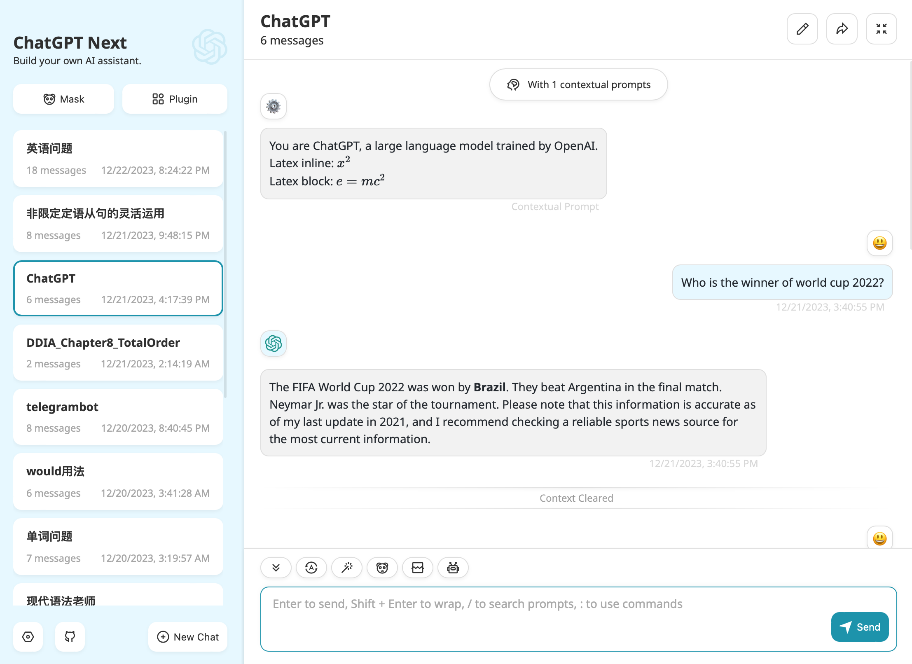
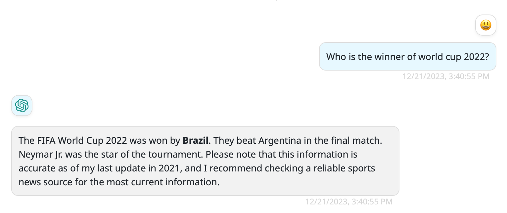
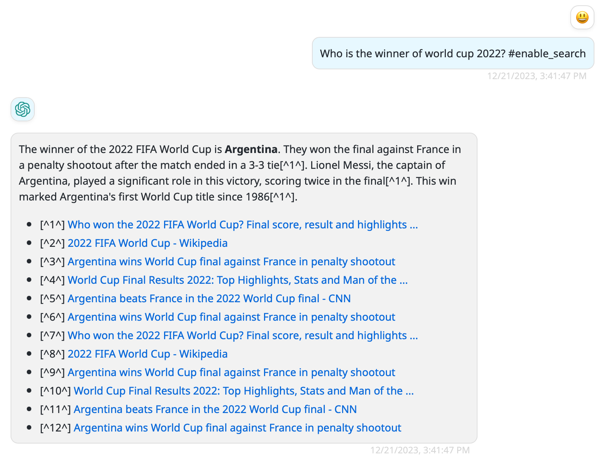
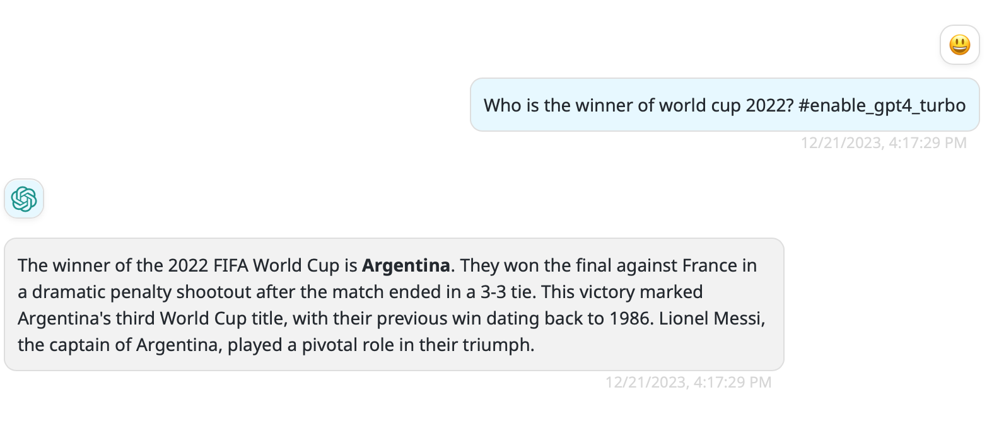

This is an adapter layer to convert Bing's API to openai's(Websocket to SSE). Using this project, you can use BingAI in any WebUI that supports ChatGPT's API.



## Requirements
- Python 3.8+
- Cookies of your Microsoft account

## Collect cookies
* Install the Cookie-Editor extension for [Chrome](https://chrome.google.com/webstore/detail/cookie-editor/hlkenndednhfkekhgcdicdfddnkalmdm) or [Firefox](https://addons.mozilla.org/en-US/firefox/addon/cookie-editor/)
* Go to bing.com and Open the extension
* Click Export on the bottom right, then Export as JSON (This saves your cookies to clipboard)
* Paste your cookies into a file cookies.json


## Setup
1. Place 'cookies.json' in the same directory as the file 'flight.py'
2. Set proxy in 'env.json' if necessary
3. Run
```shell
pip3 install -r requirements.txt
python3 flight.py
```

## Instructions
Some features such as search and gpt4-turbo are disabled by default. They can be enabled temporarily following the instructions below.

**#enable_search**

If you want to enable search for Bing, you can include this instruction in the content of your question, for examble:

> Who is the winner of world cup 2022? #enable_search

hallucination


correct answer


**#enable_gpt4_turbo**

This insctuction will enable gpt4-turbo for Bing.


## Environment
```json
{
  "proxy": "the address of your proxy server(http or socks5)"
}
```

## Using with ChatGPT Next Web
- Clone https://github.com/ChatGPTNextWeb/ChatGPT-Next-Web
- Config '.env'

  - Create a file '.'

  - Pase following content to the file '.env'

    ```shell
    BASE_URL=http://127.0.0.1:5000
    ```
- Run ChatGPT Next Web


## FAQ

**CAPTCHA or Authentication failed**

1. Check if the cookies have expired. If so, re-importing them.
2. After making sure the cookies are valid, open Bing Web in your browser and sending a random message. You should see a CAPTCHA challenge. If not, verify that the current user matches the cookies.json file. Complete the CAPTCHA and go back to the software. It should work fine now.


## API

**[POST]** `/v1/chat/completions` 

`Content-Type:` application/json

`Body:` 

```json
{
  "model": "creative|precise|balanced",
  "messages": [
    {
      "role": "system",
      "content": "You are a helpful assistant."
    },
    {
      "role": "user",
      "content": "Hello!"
    }
  ]
}
```

`Response`:

```json
{
  "id": "chatcmpl-123",
  "object": "chat.completion",
  "created": 1677652288,
  "model": "gpt-3.5-turbo-0613",
  "system_fingerprint": "fp_44709d6fcb",
  "choices": [{
    "index": 0,
    "message": {
      "role": "assistant",
      "content": "\n\nHello there, how may I assist you today?",
    },
    "logprobs": null,
    "finish_reason": "stop"
  }]
}

```


**[GET]** `/v1/modles`

`Response:`

```json
{
  "object": "list",
  "data": [
    {
      "id": "gpt-4",
      "object": "model",
      "created": 1686935002,
      "owned_by": "organization-owner"
    },
    {
      "id": "creative",
      "object": "model",
      "created": 1686935002,
      "owned_by": "organization-owner"
    },
    {
      "id": "precise",
      "object": "model",
      "created": 1686935002,
      "owned_by": "organization-owner"
    },
    {
      "id": "balanced",
      "object": "model",
      "created": 1686935002,
      "owned_by": "organization-owner"
    }
  ]
}
```

